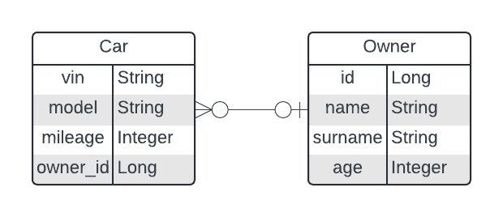

# Cars REST API
A simple project of car database API to learn Spring Boot framework basics. Data is stored using PostgreSQL database.

## Requirements
- Java 17
- Docker and Docker Compose (optionally)

## Database
### Diagram

### Setup
You can create this database using Docker with Docker Compose. Just run `docker-compose up` or `docker-compose up -d` for detached version of previous command. This will build image and run container with PostgreSQL database to connect to.

## Running  project
### _application.properties_
In order to run project first you need to define contents of _application.properties_ file. Required values are:
- **spring.datasource.url** - URL of PostgreSQL database to connect to
- **spring.datasource.username** - username to access PostgreSQL database
- **spring.datasource.password** - password to access PostgreSQL database
- **spring.datasource.driver-class-name** - class name of database driver (must be set to _org.postgresql.Driver_)
- **spring.jpa.hibernate.ddl-auto** - set it to _update_ if you want your database schema to be updated automatically after modifying entities

### Building and running
You can run properly configured project using provided _mvnw_ script in the root of folder structure. Use `./mvnw package` command to build and package project to _.jar_ file format. Then you can use Java to run it: `java --jar <path_to_jar_file>`.